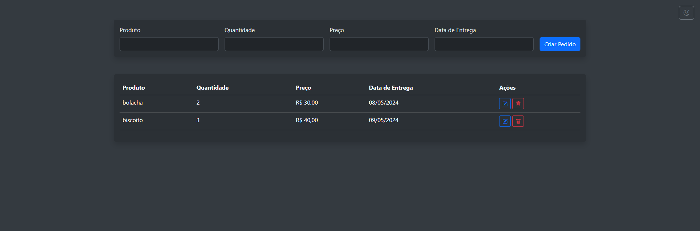
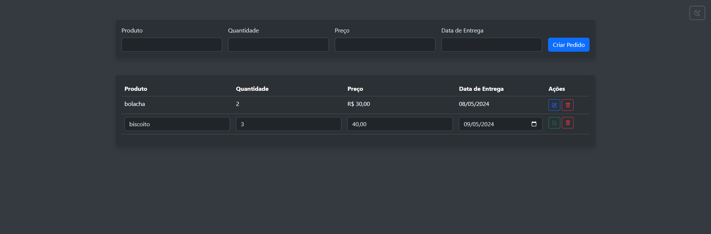
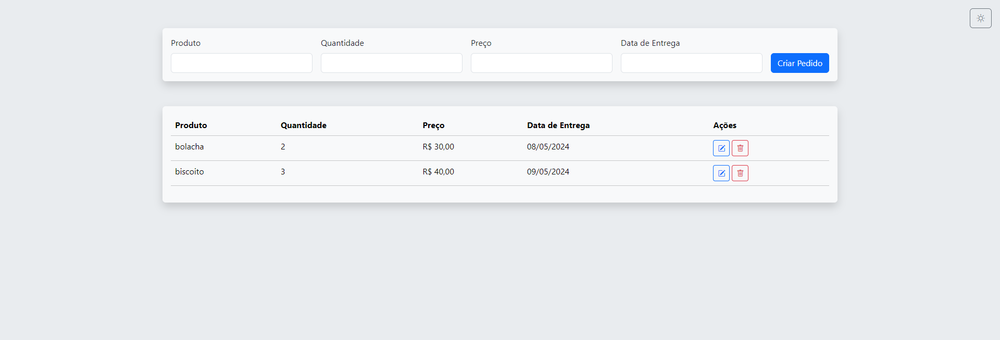
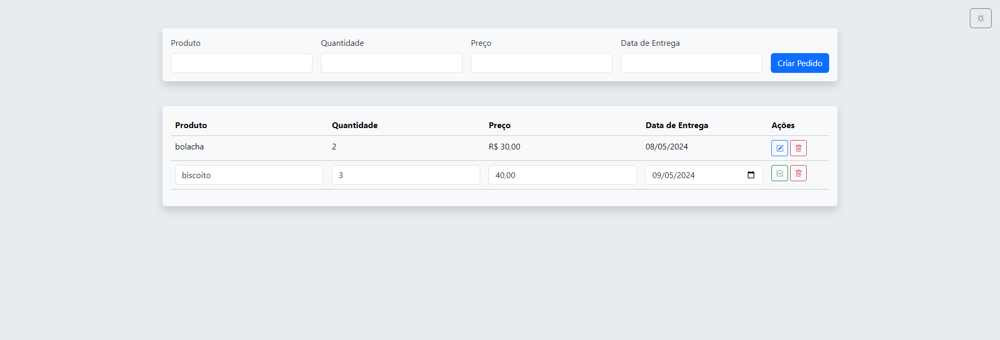

# CRUD COM NODEJS


## Conteúdo
 1. [Pré Requisitos](#pre-requisitos)
 2. [Criando o Banco de Dados](#database)
 3. [Rodando o Projeto](#rodandoprojeto)
 4. [Acessando](#access)

*******

<div id='pre-requisitos'/>

## 🚩 Pré Requisitos
- NodeJS v20.9.0 ou superior;
- PostgreSQL v16.2 ou superior;
- Extensão Live Server;

<div id='database'/>

## 🎛️ Banco de Dados
Acesse o pgAdmin e crie um Database.  Após a criação do Database, execute o script:
```
CREATE TABLE order (
    id SERIAL PRIMARY KEY,
    product VARCHAR(255) NOT NULL,
    quantity INTEGER NOT NULL,
    delivery_date DATE,
    price NUMERIC(5,2),
    created_at TIMESTAMP DEFAULT CURRENT_TIMESTAMP,
);
```

<div id='rodandoprojeto'/>

## 🚀 Rodando o projeto
- Clone o repositório;
- Navegue até a pasta <b>api</b>;
- Crie um arquivo chamado <b>.env</b>. Adicione as configurações do banco de dados, conforme modelo:
```
DATABASE_URL=postgres://{db_username}:{db_password}@{host}:{port}/{db_name}
DB_TABLE=order
PORT=3000
```
- Instale as dependências com: ```npm install```;
- Rode o servidor de desenvolvimento com ```npm run dev```;

<div id='access'/>

## 🌐 Acessando o projeto
- Acesse o arquivo frontend/index.html com o Live Server




